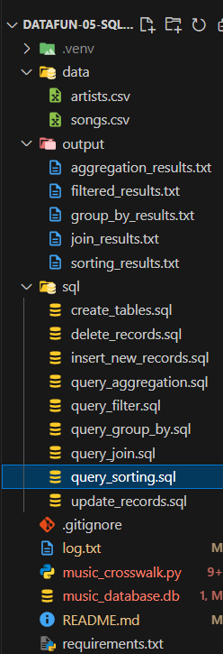
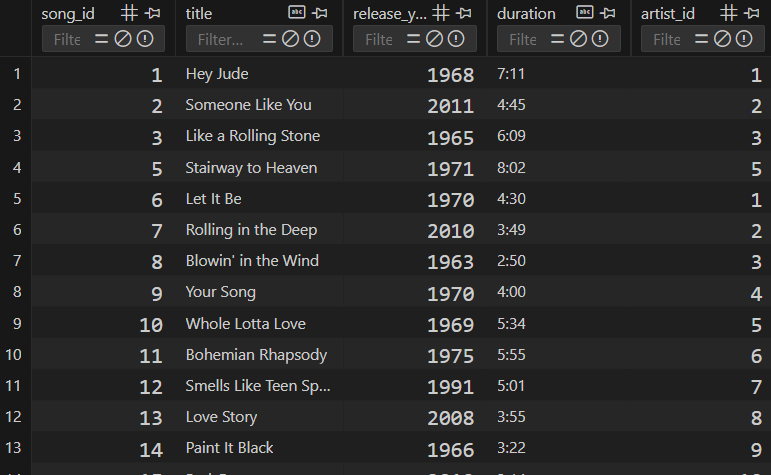
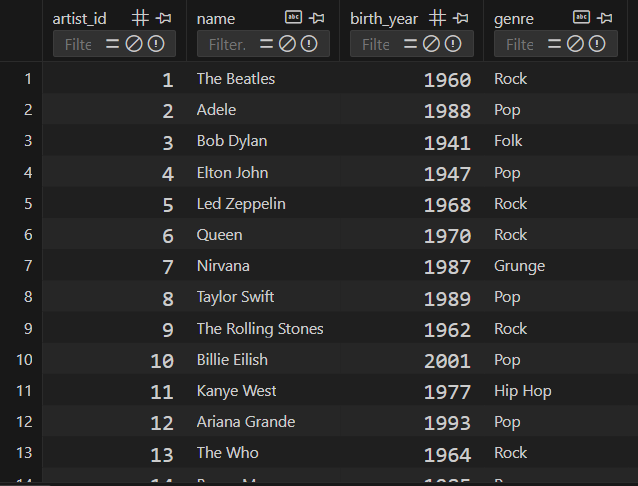
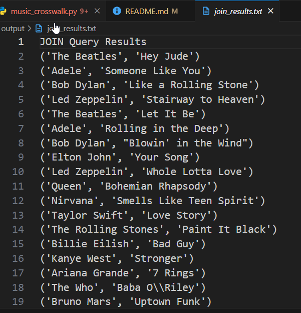
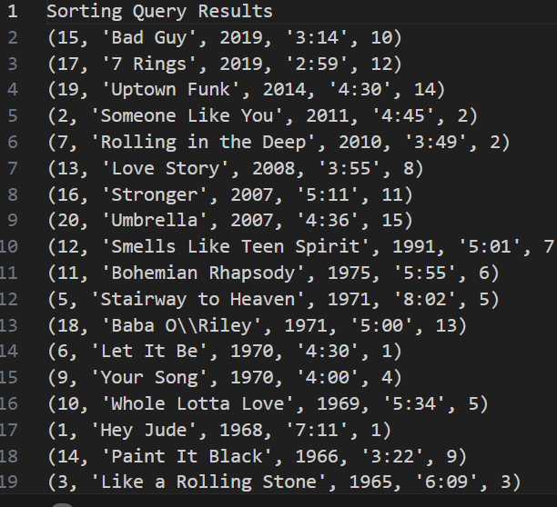

# Project 5 SQL Module

Project 5 integrates Python and SQL, focusing on database interactions using SQLite. This project introduces logging, a useful tool for debugging and monitoring projects, and involves creating and managing a database, building a schema, and performing various SQL operations, including queries with joins, filters, and aggregations.

## Create and Activate Project Virtual Environment

py -m venv .venv
.venv\Scripts\Activate

## Add and Commit Changes to Github

git add . git commit -m git push -u origin main

## Add external dependencies

pip install pandas pip install pyarrow

## Logging

import logging

--Configure logging to write to a file, appending new logs to the existing file
logging.basicConfig(filename='log.txt', level=logging.DEBUG, filemode='a', format='%(asctime)s - %(levelname)s - %(message)s')

logging.info("Program started") # add this at the beginning of the main method
logging.info("Program ended") # add this at the end of the main method

## Create files

1.  .gitignore
2.  README.md
3.  requirements.txt
4.  data folder with artits.csv and songs.csv files with data
5.  music_crosswalk.py (for Python code to run sql commands)
6.  project.db (database file created using Python code)
7.  SQL folder with the following files:  
     a. create_tables.sql - with sql code to create your database schema using sql  
     b. insert_records.sql - with sql code to insert at least 10 additional records into each table.  
     c. update_records.sql - with sql code to update 1 or more records in a table.  
     d. delete_records.sql - with sql code to delete 1 or more records from a table.  
     e. query_aggregation.sql - with sql code to use aggregation functions including COUNT, AVG, SUM.  
     f. query_filter.sql - with sql code to use WHERE to filter data based on conditions.  
     g. query_sorting.sql - with sql code to use ORDER BY to sort data.  
     h. query_group_by.sql - with sql code to use GROUP BY clause (and optionally with aggregation)  
     i. query_join.sql - with sql code to use INNER JOIN operation and optionally include LEFT JOIN, RIGHT JOIN, etc.

## Schema Design

### Schema Overview

This schema will have to tables:

1.  Artists: Stores artists details.
2.  Songs: Stores details about songs with references to the artist.

### Schema Description

1.  Artists Table: Contains artist_id (primary key), name, birth_year, and genre
2.  Songs Table: Contains song_id, title, release_year, duration and author_id

## Create Python Script to Create and Populate the Database

-def create_database(db_file_path)

-def create_tables(db_file_path, create_tables_sql_file_path)

-def insert_data_from_csv(db_file_path, artists_data_path, songs_data_path)

## Create SQL Operations

-insert_records.sql - with sql code to insert at least 10 additional records into each table.  
-update_records.sql - with sql code to update 1 or more records in a table.  
-delete_records.sql - with sql code to delete 1 or more records from a table.  
-query_aggregation.sql - with sql code to use aggregation functions including COUNT, AVG, SUM.  
-query_filter.sql - with sql code to use WHERE to filter data based on conditions.  
-query_sorting.sql - with sql code to use ORDER BY to sort data.  
-query_group_by.sql - with sql code to use GROUP BY clause (and optionally with aggregation)  
-query_join.sql - with sql code to use INNER JOIN operation and optionally include LEFT JOIN, RIGHT JOIN, etc.  
-music_crosswalk.py (for Python code to run sql commands)  
-project.db (database file created using Python code)

## Create Python Script to exececute SQL operations

#### This will execute the sql file which will insert new records into the dabatse.

-def insert_new_records(db_file_path)

#### This function is to help you confirm that the data has been successfully inserted into the artists and songs tables. It acts as a quick check to ensure that the database operations (like inserts) have worked as intended.

-def verify_records(db_file_path)

#### This will execute the sql file which will delete run the sql code to delete records.

def delete_records(db_file_path)

#### This will execute the sql file which will produce a result set that indicates how many songs are associated with each artist.

-def query_aggregation(db_file_path, output_file_path)

#### This will execute the sql file which will filer data by a specified data element (like filtering all of the pop songs).

-def query_filter(db_file_path, output_file_path)

#### This will execute the sql file which will query the database and group the data (like showing how many songs each artist has in the table with one row for each artist).

-def query_group_by(db_file_path, output_file_path)

#### This will execute the sql file which will join columns from tables together (like joining the artist with the song name).

-def query_join(db_file_path, output_file_path)

###  This will executute a sql file which will sort data (like sort songs by order of release year).  
-def query_sorting(db_file_path, output_file_path)  

#### This will execute the sql file which will update a record already in the database.

-def update_records(db_file_path)

#### This will execute the sql file which will write the results for a function to a specified file.

-def write_results_to_file(results, output_file_path, title)

## Define Main Function for SQL Operations Script

def main():
logging.info("Program started")

## Conditional Script Execution

if **name** == "**main**":
main()
